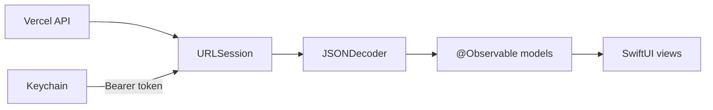

# Architecture

## Targets

The iOS workspace has two targets:

- `TrainingCoach`: the main SwiftUI app.
- `TrainingCoachWidget`: the WidgetKit extension, which also hosts the Live Activity.

## Runtime shape

Networking uses `URLSession` with async/await. The dashboard secret lives in Keychain and is sent as `Authorization: Bearer <token>` on every API request.

State lives in iOS 17+ `@Observable` models injected into SwiftUI through `@Environment`. Views should stay thin: fetch through model/service APIs, switch over explicit load states, and render.

Persistence is Keychain only. Do not add Core Data. `URLCache` is allowed as an optional offline-glance cache for the latest dashboard payload.

HealthKit is read-only for body weight, body fat percent, resting HR, workout sessions, and sleep.

Notifications use `UserNotifications` for the local 08:05 nudge. Telegram bot notifications continue to cover server push.

## Design tokens

Keep shared visual rules in:

- `Theme/Colors.swift`
- `Theme/Typography.swift`
- `Theme/RecoveryBand.swift`

## Why iOS 17 (not 16)

- App Intents in WidgetKit are required for the Interactive Widget premium feature.
- The `@Observable` macro gives cleaner model state than iOS 16-era `ObservableObject` boilerplate.
